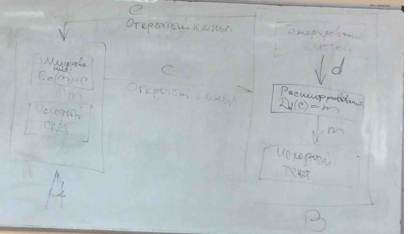

# Конспект по дисциплине "Защита Информации" (ЗИ)

## Информационная безопасность (ИБ)

Требования:

- законность;
- разумная доступность;
- баланс между интересами личности и предприятия;
- высокая квалификация сотрудников ИБ;
- соблюдение правил ИБ пользователями;
- сотрудничество с правоохранительными органами

Рекомендации по создании ИБ:

- простота технического обслуживания, прозрачность;
- минимум привилегий пользователя для выполнения работы;
- аварийное отключение защиты для выполнения работы;
- независимость субъекта от объекта;
- пользователь вредитель системы;
- минимум инфы знают пользователи об Система Защиты Информации(СЗИ).

## ЗИ

Условия:

- конфиденциальность;
- целостность;
- доступность.

> Цель - минимизировать утечку инфы и НеСанкционнированный Доступ(НСД)

Требования к СЗИ:

- централизованность
- плановость;
- конкретность и целенаправленность;
- активность;
- надежность и универсальность;
- нестандартность;
- открытость;
- экономическая эффективность.

## Право на доступ

Система Информационной Безопасности (СИБ):

- выявленние ценностей в организации ===список заинтересованных лиц;
- установление границ ИБ === выявление уязвимых мест;
- анализ риска === план защиты;
- проведение мероприятий тех, организационного характера === политика ИБ;
- составление эффективных моделей и тестирование === отбор эффективных моделей по тестированию;
- составление плана защиты === план защиты;
- реализация плана защиты === монтаж.

## Угрозы информации

> Возможность возникновения на каком-либо этапе жизнедеятельности системы такого явления или события, следствием которого могут быть нежелательные воздействия на информацию.

### Виды угроз

Основные нарушения:

- физической целостности(уничтожение, разрушение элементов);
- Логической целостности(разрушение логических связей);
- содержания(изменение блоков информации, внешнее навязывание ложной инфы);
- конфиденциальности(разрушение защиты, уменьшение степени защищенности инфы);
- прав собственности на информацию(несанкционированое копирование, использование).

Наиболее выраженные угрозы:

- подверженность физическому искажению или уничтожению;
- возможность несанкционированной (случайно или злоумышленной) модификации;
- опасность несанкционированного (случайного и преднамеренного) получение ифы.

Характер происхождения угроз:

- умышленные факторы:
  - хищение носителей инфы;
  - подключение к каналам связи;
  - перехват Электро-Магнитного Излучения;
  - несанкционированный доступ;
  - разглашение инфы;
  - копирование данных;

- естественные факторы:
  - несчастные случаи(пожары, аварии, взрывы);
  - стихийные бедствия (ураганы, наводнения, землетрясения);
  - ошибки в процессе обработки инфы (ошибки пользователя, оператора, сбои аппаратуры).

Источники угроз, непосредственный исполнитель угрозы в плане ее негативнго воздействия на инфу:

- люди;
- технические устройства;
- модели, алгоритмы, программы;
- технологические схемы обработки;
- внешняя среда.

Предпосылки появления угроз:

- объективные (количественная или качественная недостаточность элементов системы);
> Причины, не связанные непосредственно с деятельностью людей и вызывающие случайные по характеру происхождения угрозы.
- субъективные
> Причины, непосредственно связанные с деятельностью человека и вызывающие как преднамеренные (деятельность разведок иностранных государств, промышленный шпионаж, деятельность уголовных элементов и недобросовестных сотрудников) и непреднамеренные угрозы инфы(плохое психологическое состояние, недостаточная подготовка).

## Классы каналов несанкционированного получения инфы

> [Источник инфы -> средство обработки инфы] - объект

- От источника инфы при несанкционированном доступе к нему:
  - хищение инфы
  - копирование инфы с носителя
  - прослушивание разговоров
  - установка закладок в помещение и съем с их помощью инфы;
  - выведывание инфы у обслуживающего персонала на объекте;
  - фотографирование или видеосъемка носителей информации внутри помещения;
- Со средств обработки инфы при несанкционированном доступе к ним:
  - Снятие инфы с устройств электронной памятью;
  - установка закладок в средства обработки инфы;
  - ввод программных продуктов, позволяющих злоумышлинику получить инфу;
  - копирование инфы с технических устройств отображение (фотографирование с мониторов и др.);
- От источника без санкционированного доступа к нему:
  - получение инфы по акустическим каналам (в системах вентиляции, теплоснабжения, с помощью направленных микрофонов);
  - получение инфы по виброакустическим каналам (лазерных устройств);
  - использование технических средств оптической разведки(биноклей, подзорных труб);
  - использование технических средств оптико-электронной разведки(внешних телекамер, приборов ночного видения;
  - осмотр отходов и мусора;
  - выведывание инфы у обслуживащего персонала за пределами объекта;
  - изучение выходящей за пределы объекта открытой инфы(публикаций, рекламных объектов);
- Со средств обработки инфы без несанкционированного доступа (СОИ - средства обработки инфы):
  - электромагнитные излучения СОИ (паразитные электромагнитные излучения, паразитная генерация усилительных каскадов, паразитная модуляция высокочастотных генераторов низкочастотным сигналом, содержащим конфиденциальную инфу);
  - электромагнитные излучения линий связи;
  - подключения к линиям связи;
  - снятие наводок электрических сигналов с линий связи;
  - снятие наводок с системы питания;
  - снятие наводок с системы заземления;
  - снятие наводок с системы теплоснабжения;
  - использование высокочастотного навязывания;
  - снятие с линий, выходящих за пределы объекта сигналов образованных на технических средсвах за счет акустоэлетрических преобразований;
  - снятие излучений оптоволоконных линий связи;
  - подключение к базам данных и ПЭВМ по компьютерным сетям.

Причины нарушения целостности информации:

- субъективные:
  - диверсия(организация пожаров, взрывов, повреждении электропитания);
  - непосредственные действия над носителем (хищение, подмена носителя, уничтожение инфы);
  - информационное воздействие (электромагнитное облучение, ввод в компьютерные состемы разрушающих программ, воздействие на психику личности человека);

- субъективные преднамеренные:
  - отказ обслуживающего персонала (гибель, длительных выход из строя);
  - сбои людей (временных выход из строя);
  - ошибки людей;

- объективные:
  - объективные непреднамеренные;
  - отказы(полный выход из строя) аппаратуры, программ, систем питания и жизнеобеспечения;
  - сбои (кратковременный выход из строя) аппаратуры, программ, систем питания и жизнеобеспечения;
  - стихийные бедствия (наводнения, землетрясения, ураганы);
  - несчастные случаи (пожары, взрывы, аварии);
  - электромагнитная несовместимость;

Структурная схема потенциално возможных злоумышленных действий в автоматизированных системах обработки данных для самого общего случая (фото в телефоне).

Злоумышленные действия:

- внешняя неконтролируемая зона;
> Территория вокруг автоматизированной системы обработки данных, на которой персоналом и средствами автоматизированной системой обработки данных не применяются никакие средства и не осуществляется никакие мероприятия для защиты информации.
- зона контролируемой территории;
> Территория вокруг помещений автоматизированной системы обработки данных, которая непрерывно контролируется персоналом или средствами автоматизированной системы обработки данных;
- зона помещения;
> Внутреннее пространство тех помещений, в которых расположена система.
- зона ресурсов;
> Та часть помещения, откуда возможен непосредственный доступ к ресурсам системы;
- зона баз данных.
> Та часть ресурсов системы, с которых возможен непосредственный доступ к защищаемым данным.

## Несанкционированное получение инфы(НПИ)

Условия при которых НПИ возможно:

- нарушитель должен получить доступ в соответствующую зону;
- во время нахождения нарушителя в зоне в ней должен проявиться (иметь место) соответствуюий канал НПИ;
- соответсвующий канал НПИ должен быть доступен нарушителю соответствующей категории;
- в канале несанкционированного получения инфы в момент доступа к нему нарушителя должна находиться защищаемая инфа.

### Общая модель воздействия на информацию

Модель IBM:
$$R=10^{(S_i+V_i-4)},$$

где
> $Si$ - коэффициент, характеризующий возможную частоту возникновения соответствующей угрозы.
> $Vi$ - коэффициент, характеризующий возможный ущерб при возникновении угрозы.

Суммарная стоимость потерь:
$$R=\sum_{i=1}^{n} R_i,$$

где
> $R_i$ - сколько денег потеряем при ущербе.

Общая модель процесса нарушения физических целостности инфы

## Система с полным перекрытием

Методика формального описания:

- составляется полный перечень объектов
- составление двудольного графа с соблюдением условия:
> ребро $<t_i, o_j>$ существует только тогда, когда угроза $t_i$ является реальной для объекта $o_j$.
- для каждого ребра в графе определяется количественная мера соответствующей угрозы для соответствующего объекта;
- формируется множество М средств защиты информации в вычислительной системе;
- определяется количественная мера возможности противодействия превышает уровень угрозы, то соответствующее ребро графа исключается.

Рекомендации по использованию моделей оценки уязвимости инфы:

- каждая угроза должна быть самостоятельная;
- каждое средство нейтрализует только одну угрозу;
- чтобы модель была эффективной нужно максимально предложить большее количество вариантов.

### Идивидуальные задание

> Осмотриваем объект под какими угрозами он находиться. Потом смотрим меры защиты (организационные или технически).
``Для отчетов используем ОС ТУСУР.``
> ``Введение`` - содержит описание объекта.
> ``Угрозы`` - перечислить не менее 15 угроз, которые не перекрываются имеющемися средствами защиты. Затем отсортировать к каким типам угроз относятся, ранжировать потери от каждой угрозу для организации(расчет).
> ``СЗИ`` - имеющиеся средства защиты, для устранения угроз, воздействие для определенной угрозы (если перекрывает несколько, то записать для каждой угрозы это средство повторно), расчеты по внедрению СЗИ.
> ``Заключение`` - делаем выводы, описываем какую работу проделали, сравниваем угрозы и СЗИ и проводим экономическую целесообразность внедрения СЗИ.

## Криптография

$$E_e(m)=c, c\in C, m\in M$$

где
> $K$ - пространство ключей.
> $e$ и $d$ - ключи шифрования и расшифрования.
> $E_e$ - функция шифрования для произвольного ключа $e\in K$.
> $C$ - пространство шифротекстов.
> $M$ - пространство сообщений.
---
> ``Криптография`` - занимается поиском и исследованием математических методов преобразования информации.
> ``Криптоанализ`` - занимается исследованием возможности получения информации без знания ключей.

Разделы криптографии:

- симетричные;
- криптосистемы с открытым ключом (ассиметричные, несиметричные);
- электронная подпись (аналог рукописной, нужна для установления подлинности);
- управление ключами.

Основные направления использования криптографических методов:

- передача конфидициальной инфы по каналам связи и установление подлинности передаваемых сообщений;
- хранение информации на носителях информации в защифрованном виде.

В качестве инфы подлежащей шифрованию и дешифрованию расматриваются тексты построенные на некотором алфавите.
> ``Алфавит`` - конечное множество, используемое для кодирования информации, знаков.
> ``Текст`` - упорядоченный набор из элементов алфавита.
> ``Шифрование`` - преобразовательный процесс, при котором исходный текст (открытый текст) заменяется шифрованным текстом.
> ``Дешифрование`` - обратный процесс шифрованию, на основе ключа зашифрованный текст преборазуется в исходный.
> ``Ключ`` - информация необходимая для ширования и дешифрования текстов.
> ``Криптографическая система`` - представляет собой семейство преобразований открытого текста $T$, члены $k$ (ключ).
> ``Пространство ключей`` $k$ - набор возможных ключей, как правило ключ представляет собой последовательный ряд алфавита.

[Криптосистемы:](https://tproger.ru/articles/cryptography-encryption/)

- симметричные (для расшифровки и дешифровки только один ключ [закрытый]);
- ассиметричные (с открытым ключом).

``В Системе с открытым ключом используются два ключа`` - открытый и закрытый, при этом ключи связаны между собой математически. Информация шифруется с помощью открытого ключа, который доступен всем желающим, а расшифровывается с помощью закрытого ключа, известного только получателю инфы.
Управление ключами (распределение ключей) связано с процессом распределения ключей, а также их составлением, при этом распределение ключей среди пользователей.

> ``Электроная подпись(ЭП)`` - присоединяемая к тексту его криптографическое преобразование, которое позволяет при получении к тексту другим пользователям проверить авторство и подлинность сообщения.
> ``Криптостойкость`` - характеристика шифра, определяющая его стойкость к криптоанализу.

Два наиболее распространенных показателя криптостойкости:

- количество всех возможных ключей;
- среднее время нужное для криптоанализа.

``MiTM`` - в системах с открытых системах осуществляется подменой исходного сообщения, так как известен открытый ключ, то можем зашифровать сообщение злоумышленника, "спасет" ЭП, метка времени (за какое время было зашифровано сообщение).

Требования к криптосистемам:

- зашифрованное сообщение должно поддаваться чтению только при наличие ключа;
- число операций неоходимых для определения использованного ключа шифрования, по фрагменту шифрованного сообщения и соответствующего ему открытого текста, должно быть не меньше общего числа возможных ключей;
- число операций необходимых для расшифровывания информации путем перебора все возможных ключей должно иметь строгую нижнию оценку и выходить за пределы возможностей современных компьютеров;
- знание алгоритма шифрования не должно влиять на надежность защиты;
- незначительное изменение ключа должно приводить к существенному изменению вида зашифрованного сообщения;
- структурные алгоритмы элементов шифрования должны быть неизменными;
- дополнительные биты, вводимые в сообщение в процессе шифрования, должны быть полностью и надежно скрыты в шифрованном тексте;
- длина шифрованного текста желательна должна быть равна длине исходного текста;
- не должно быть простых и легко устанавливаемых зависимостей между ключами, последовательно используемыми в процессе шифрования;
- не нужно и не следует использовать предсказуемые ключи: 1234 и затем 12345 &#128584;;
- любой ключ из множества возможных должен обеспечивать надежную защиту информации;
- алгоритм должен допускать как программную, так и аппаратную реализацию.

Виды атак на криптосистемы:

- при знании только шифрованного текста(иностранные языки, умершие языки при археологии);
- со знанием содержимого шифровки(к примеру, один исходный и зашифрованный текст, цель получения ключа);
- атака с заданным текстом (даем жертве известный нам текст, он генерирует нам зашифрованный текст, мы можем найти закономерность между этими текстами);
- MiTM;
- атака с помощью таймера(замеры на шифрование определенным алгоритмом шифрования).

Критерии эффективности криптосистемы:

- невозможность раскрытия или осмысленной модификации инфы на основе анализа ее структуры;
- совершенство используемых протоколов защиты(как давно были придуманы эти протоколы для защиты данной криптосистемы);
- минимальный объем изученной инфы(чем меньше ключей, тем меньше сведений о системе);
- минимальная сложность и стоимость реализации системы;
- высокая оперативность (об оперативности вычислений по шифр текстам исходных текстов, смена ключей).

## Классификация криптосистем

Криптографическое закрытие инфы
АП - аппаратно(А)-программная(П) реализация

Вид преобразования - Шифрование. Спрособ преобразования - Замена (подстановка). Разновидность способа:

- простая(одноалфавитная);
- многоалфавитная (одноконтурная обыкновенная);
- многоалфавитная одноконтурная монофоническая;
- многоконтурная многоалфавитная.

Способ преоразования - перестановка. Разновидность способа:

- простая;
- усложненная по таблице, по маршрутам.

Способ преобразования - аналитическое преобразование. Разновидность способа:

- по правилам алгебры матриц
- по особым зависимостям

Способ преобразования - гамирование(АП). Разновидность способа:

- с конечной короткой гаммой;
- с конечной длинной гаммой
- с бесконечной гаммой;

Способ преоразования - комбинированные(АП). Разновидность способа:

- замена+перестановка;
- замена + гаммирование
- перестановка+гаммирование;
- гаммирование+гаммирование

Вид преобразования - Кодирование

- Смысловое
  - по специальным таблицам
- символьное - по кодовому алфавиту

Вид преобразования - Другие виды:

- рассечение-разнесение
  - смысловое
  - механическое
- сжатие-расширение

## Парольная система защиты

Примерная структура парольной системы защиты состоит из следующих компонентов:

- интерфейс пользователя;
- интерфейс админа;
- база учетных записей пользователей;
- модуль сопряжения с другими подсистемами безопасности.

Требования к паролю:

- сколько нужно времени чтобы подобрать пароль с помощью определенных вычислительных мощностей;
- определенная минимальная длина;
- использование в пароле различных групп символов;
- проверка и отбраковка паролю по словарю;
- установление максимального действия пароля;
- введение журнала истории паролей;
- ограничение попыток ввода пароля;
- поддержка режима принудительной смены пароля пользователя;
- использование задержки при вводе неправильного пароля;
- запрет на выбор пароля самим пользователем или автоматическая генерация пароля;
- принудительная смена пароля при первой регистрации пользователя в системе.

Для того чтобы дать численную оценку парольной системы защиты:

> ``A`` - мощность алфавита паролей; множество знаков, которое может применяться при вводе пароля.
> ``L`` - длина пароля, измеряется в количестве символов
> ``S`` - мощность пространства паролей, множество всех возможных паролей в системе.

Для того чтобы определить мощность пароля:
$S=A^L$,
$P=(V-T)/S$,
где
> $V$ -  скорость подбора пароля, измеряется пароли в количество времени.
> $T$ - срок действия (жизни) пароля.
> $P$ - вероятность подбора пароля, в течение срока его действия.

## Политика безопасности(ПБ)

### Мандатная ПБ

> Основу составляет мандатное управление доступом, которое подразумевает, что все объекты и субъекты системы должны быть однозначно идентифицированы.Должен быть задан линейно упорядоченный набор меток конфиденциальности. Каждому объекту системы должна быть присвоена метка конфиденциальности, определяющая ценность содержащейся в нем информации. Каждому субъекту системы должна быть присвоена метка конфиденциальности, определяющая уровень доверия к нему в автоматизированной системе.

[Модель Белла-Лападулы.](https://goo.gl/bx89Ky)

``Основная цель`` - предотвращение утечки информации от объектов с высоким уровнем доступа к объекта с низким уровнем доступа. При построение данной системы предполагают, что "если начальное состояние системы безопасно и все переходы системы из состояния в состояние не нарушают ограничений, сформулированных политикой безопасности, то либое состояние системы безопасно.
``Минусы`` - сложна в реализации, требует значительных вычислительных ресурсов.
``Плюсы`` - более проста для понимания в реализации.

### Дискреционная(дискретная) ПБ

Определяется двуми свойствами:

- все субъекты и объекты должны быть идентифицированны;
- права доступа субъекта к объекту системы определяется на основании некоторого внешнего по отношению к системе правил.

> В соответствии с этой политикой каждый объект объявляется соответствующего пользователя. Пользователь, являющийся собственником объекта, имеет все права доступа к нему, а иногда и право передавать часть или все права доступа другим пользователям, при этом он определяет права доступа других субъектов к этому объекту. Указанные права доступа записываются в виде матрица доступа, элементы которой определяют доступ субъекта к объекту.

Варианты задания матрицы доступа:

- листы возможностей (Когда для каждого субъекта создается лист всех объектов, к которым имеет доступ данных субъект.);
- лист контроля доступа (Для каждого объекта создается список всех субъектов, имеющих право доступа к этому объекту).

``Основная проблема`` - контроль распранения прав доступа, когда собственник папки предоставляет слишком "широкие" права другим пользователям, что в свою очередь эти другие пользователи могут предоставить другим и отследить кто изменил довольно сложно.
``Плюсы`` - простота реализации.
``Недостатки`` - относительная статичность модели, выражается в том, что однажды задав для объектов какие-то права, затем кто-то начал создавать новые объекты без разграничения прав. Таким образом часть объектов находиться в защищенности, другие нет.

## Стеганография

> ``Стеганография`` - сокрытие самого факта присутствия ценной инфы.(водяные знаки, вредоностное ПО, идентификационные коды производителя продукта).
> ``Криптография`` - искажение сообщения для закрытия от посторонних.

Основные принципы:

- сообщение можно послать, используя шумовое кодирование. Оно будет трудно определимо на фоне аппаратных шумов в телефонной линии или сетевых кабелей.
- файлы, содержащие оцифрованное изображение или звук, можно исказить без потери функциональности и информационного содержания, так как в подобных данных не требуется абсолютная точность.

> ``Стеганографическая система или стегосистема`` - совокупность средств и методов, которые используются для формирования скрытого канала передачи информации.

### Обобщенная модель стегосистемы

> ``Контейнер`` - то, куда будет происходить встраивание ценной инфы; любая информация, предназначенная для сокрытия тайных сообщений.
> ``Пустой контейнер`` - контейнер без встроенного сообщения; заполненный или стего-контейнер - контейнер с тайной инфой.
> ``Стегоканал`` - канал передачи стего.
> ``Встроенное сообщение`` - ценная инфа.
> При встраивании используется некий ключ отправителем, при извлечении используется также ключ из контейнера для получения встроенного сообщения.
> ``Ключи`` - открытый(для упаковки) и закрытый ключ(для извлечения), полная аналогия с криптосистемами.
> ``Требования к стегосистемам`` - свойства контейнера должны быть модифицированы, чтобы изменение невозможно было выявить при визуальном контроле. Это требование определяет качество сокрытия внедряемого сообщения: для обеспечения беспрепятственного прохождения стегосообщения по каналу связи оно никоим образом не должно привлечь внимание атакующего.
> ``Положение построения стегосистемы`` - противник имеет полное представление о стеганографической системе и деталях ее реализации. Едиственной информацией, которая остается неизвестной потенциальному противнику, является ключ, с помощью которого только его держатель может установить факт присутствия и содержание скрытого сообщения.

## Основные определения

``Информация`` - сведения о лицах, сведениях, фактов, независимо от формы их представления; свойство объекта уменьшать неопределенность процесса, изменение его состояний во времени.
``Целостность`` - способность средства вычислительной техники или АС обеспечивать неизменность информации, в условиях случайного и/или преднамеренного искажения, либо разрушения.
``Носитель информации`` - физическое лицо, либо материальный объект, в том числе физическое поле(поля таблицы), в которых информация находит свое отображение в виде символов, образов, сигналов технических решений, процессов.
``Документ`` - материальный объект, с зафиксированной на нем информацией в виде текста, звукозаписи или изображения, предназначенный для передачи во времени и пространстве в целях хранения и общественного использования.
``Документ`` - зафиксированное на материальном носителе информации с реквизитами позволяющеми ее идентифицировать.
``Информационные ресурсы`` - отдельные документы и отдельные массивы документов в информационных системах, например, библиотека, архив.
``Информационная система`` - организационная упорядоченность документов и информационных технологий, в том числе с использованием средств вычислительной техники и связей, реализующих информационный процесс; совокупность, содержащаяся в базах данных информации и обеспечивающих ее обработку информационных технологий и технических средств.
``Собственник информации`` - субъект, в полном объеме реализующий полномочия владения/пользования и распоряжения информацией в соответствии с законодательными актами.
``Владелец информации`` - субъект, осуществляющий владение и пользования информации и реализующий полномочия распоряжения в пределах прав, установленных законом и/или собственником информации.
``Обладатель информации`` - лицо, самостоятельно создавшее информацию, либо получившее на основании закона, или договора, право разрешать или ограничивать доступ к информации, определяемой по каким-либо признакам.
``Пользователь информации`` - субъект, пользующийся информацией полученной от ее собственника, владельца и посредника в соответствии с установленными правами и правилами, доступа к информации, либо с их нарушением.
``Служебная информация ограниченного распространения`` - не секретная информация, касающаюся деятельности организации, ограничение на распространение которой диктуется служебной необходимостью.
``Конфиденциальная информация`` - документированная информация, доступ к которой ограничивается в соответствии с законодательством РФ; обязательное для выполнения лицом, получившим доступ к определенной информации, требование не передавать такую информацию третьим лицам без согласия ее обладателям.
``Метка конфиденциальности`` - элементы информации, характеризующие конфиденциальность информации. содержащийся в объекте.

Категорирование защищаемой информации:

- установление градации важности защищаемой информации;
- наделение носителя информации грифом "секретно".

``Персональные данные`` - сведения о фактах, событиях, обстоятельствах жизни гражданина, позволяющих идентифицировать его личность однозначно; любая информация, относящаяся к определенному или определяемому такой информации физическому лицу(субъект персональных данных).
``Общедоступные персональные данные`` - персональный доступ к данным, неограниченный круг лиц к которой предоставлен с согласия субъекта персональных данных или на которые в соответствии с федеральными законами не распространяется требования соблюдения конфиденциальности.
``Служебная коммерческая тайна`` - информация, имеющая потенциально или действительно коммерческую ценность, в силу неизвестности ее третьим лицам, к ней нет свободного доступа на законном основании и владелец принимает меры ограничения доступа к ней.
``Коммерческая тайна`` - конфиденциальность информации, позволяющая ее обладателю при существующих или возможных обстоятельвах увеличить доходы, избежать неоправданные расходы, сохранить положение на рынке товаров, работ, услуг или получить иную коммерческую выгоду.
``Электронный документ`` - документ, в котором информация представлена в электронно-цифровой форме.
``Электронная подпись`` - реквизит электронного документа, предназначенный для защиты данных данного электронного документа от подделки, полученой в результате криптографических преобразований информации с использованием закрытого ключа электронной подписи, позволяющей идентифицировать владельца ключа электронной подписи, а также установить отсутствие искажений информации в электронном документе.
``Сертификат ключа подписи`` - электронный или бумажный документ, содержащий открытый ключ, информацию о владельце ключа, области применения ключа, подписанный выдавшим его Удостоверяющим центром и подтверждающий принадлежность открытого ключа владельцу.
``Пользователь сертификата ключа подписи`` - физическое лицо, использующее полученные в удостоверяющем центре сведения о сертификате ключа подписи для проверки принадлежности электронной подписи пользователю сертификата ключа пользователя.
``Владелец сертификата ключа подписи`` - физическое лицо, на имя которого удостоверяющим центром выдан сертификат ключа подписи и которое владеет соответствующим ключом электронной подписи, позволяющим с помощью средств электронной подписи создавать свою электронную подпись в электронных документах.
``Открытый ключ электронной подписи`` - уникальная последовательность символов, соответствующая доступная любому пользователю информационной системы и предназначенная для подтверждения с использованием средств электронной подписи подлинности электронной подписи в электронном документе.
 ``Субъект доступа`` - лицо или процесс, действия которого регламентируются правилами разграничения доступа.
``Объект доступа`` - единица информационного ресурса в АС, доступ к которой регламентируется правилами разграничения доступа.
``Доступ к информации`` - ознакомление с информацией, ее обработка, в частности копирование, модификация или ее уничтожение; получение субъектом возможности с ознакомлением информации, в том числе при помощи технических средств.
``Доступность информации`` - состояние инфы, характеризуемая способность технических средств и информационных технологий обеспечивать беспрепятственный доступ к информации субъектов, имеющих на это полномочий.
``Правила доступа к информации`` - совокупность правил, регламентирующих порядок и условия доступа субъекта к информации и ее носителям.
``Правила разграничения доступа`` - совокупность правил, регламентирующих права доступа субъектов доступа к объектам доступа.
Несанкционированный доступ (к информации) - доступ к информации, нарушающий установленные правила ее получения.
``Аутентификация`` - праверка принадлежности субъекта доступа предъявленного им идентификатора, а также подтверждение подлинности.
``Идентификация`` - присвоение субъектам или объектам доступа идентификатора и/или сравнение предъявляемого идентификатора с перечнем ранее присвоенных.
``Авторизация`` - предоставление определенному кругу лиц или группе лиц, лицу прав на выполнение определенных действий, а также процесс проверки прав при попытке выполнения этих действий.
``Пароль`` - идентификатор субъекта, являющейся его секретом.
``Верефикация`` - процесс сравнения двух уровней спецификаций вычислительной техники или средств надлежащих сравнению.